<div align="center">


# Tenadam — Health of Adam

**A modern, full-featured Hospital Management System built with Laravel 10**

[](https://laravel.com)
[](https://www.php.net)
[](LICENSE)
[](https://sqlite.org)
[](https://laravel-livewire.com)

**ጤና አዳም** — *Your complete digital healthcare platform*

</div>

---

## 🖼️ Screenshots

### Login

Secure authentication page with language selection support.


---

### 👑 Admin Dashboard

Full control over every module — patients, doctors, billing, pharmacy, inventory, and more. Comprehensive analytics with revenue charts, appointment stats, staff counts, and quick-access cards for all hospital operations.

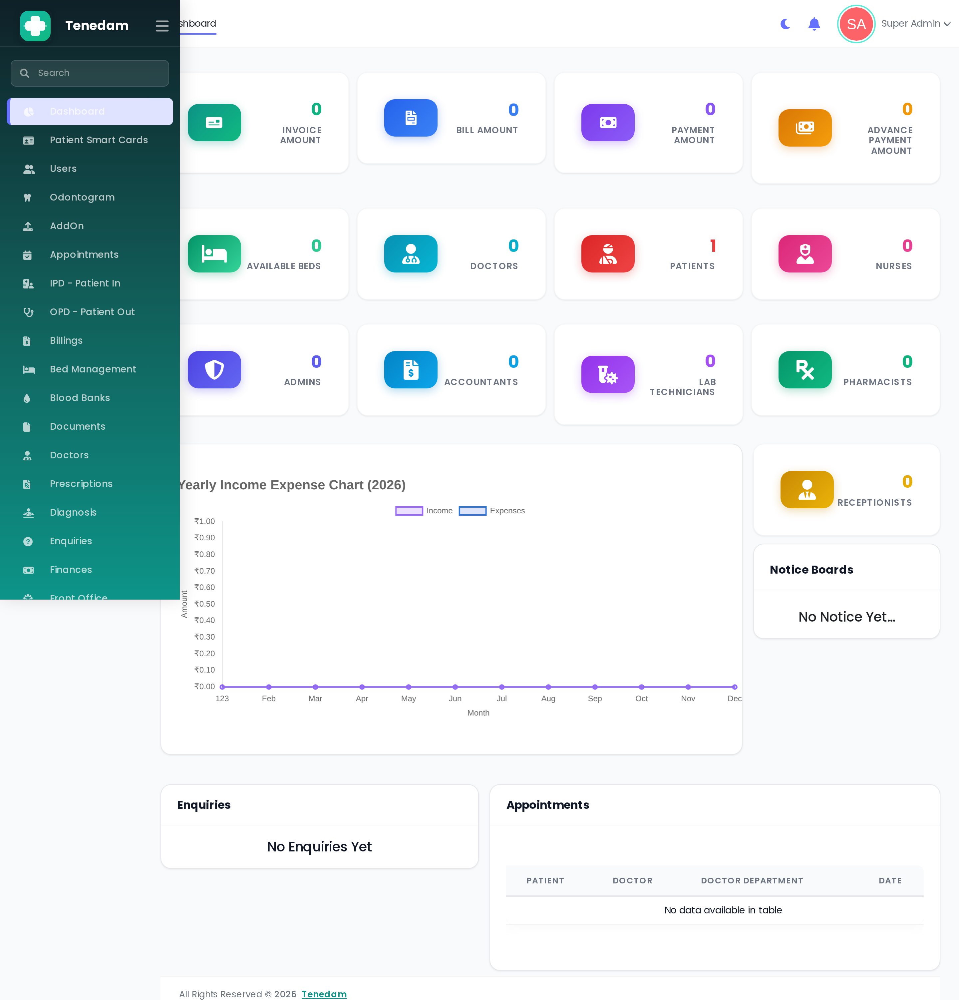

---

### 👨‍⚕️ Doctor Dashboard

Doctors see the employee directory and manage their patient roster, OPD/IPD cases, prescriptions, and daily schedules at a glance with quick access to clinical workflows.

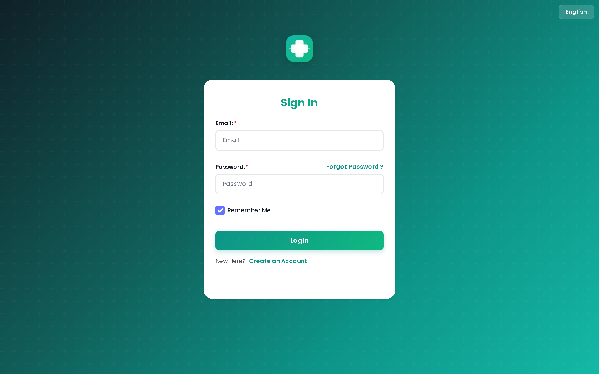

---

### 👩‍⚕️ Nurse Dashboard

Nurses manage bed types and bed availability in real-time — tracking ward status, managing patient bed assignments, and monitoring IPD patient flow across departments.


---

### 🏢 Receptionist Dashboard

Receptionists manage the front desk — appointment booking, patient registration, visitor management, and the complete daily appointment flow with calendar views.


---

### 💊 Pharmacist Dashboard

Pharmacists manage the complete medicine billing workflow — prescription fulfillment, medicine sales tracking, and billing reports for the pharmacy.


---

### 💰 Accountant Dashboard

Accountants handle all financial operations — invoice management, bill tracking, payment records, and comprehensive financial reporting across the organization.


---

### 📋 Case Manager Dashboard

Case managers coordinate patient cases through the employee directory — tracking case progression, assigning doctors, managing patient flow between departments, and ensuring continuity of care.


---

### 🧪 Lab Technician Dashboard

Lab technicians manage radiology test workflows — test categories, parameters, investigation reports, and results processing across all diagnostic services.

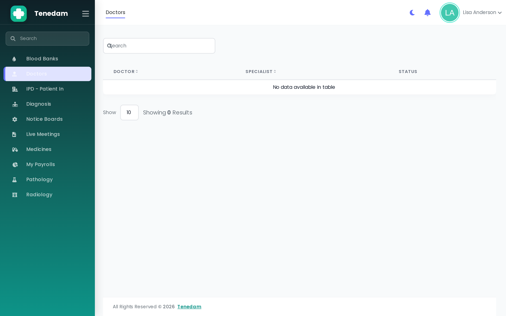

---

### 🤒 Patient Dashboard

Patients get a self-service portal — viewing their appointments, medical records, prescriptions, bills, vaccination history, and communicating with their healthcare providers.

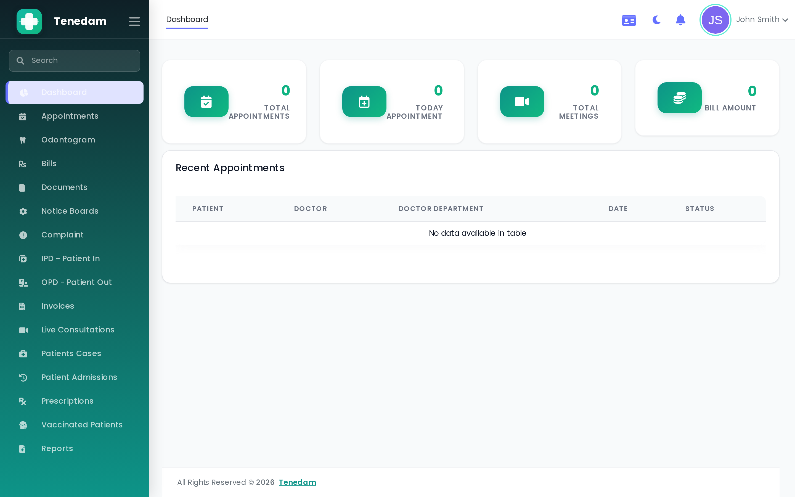

---

### 📊 Feature Pages — Admin View

<table>
<tr>
<td width="50%">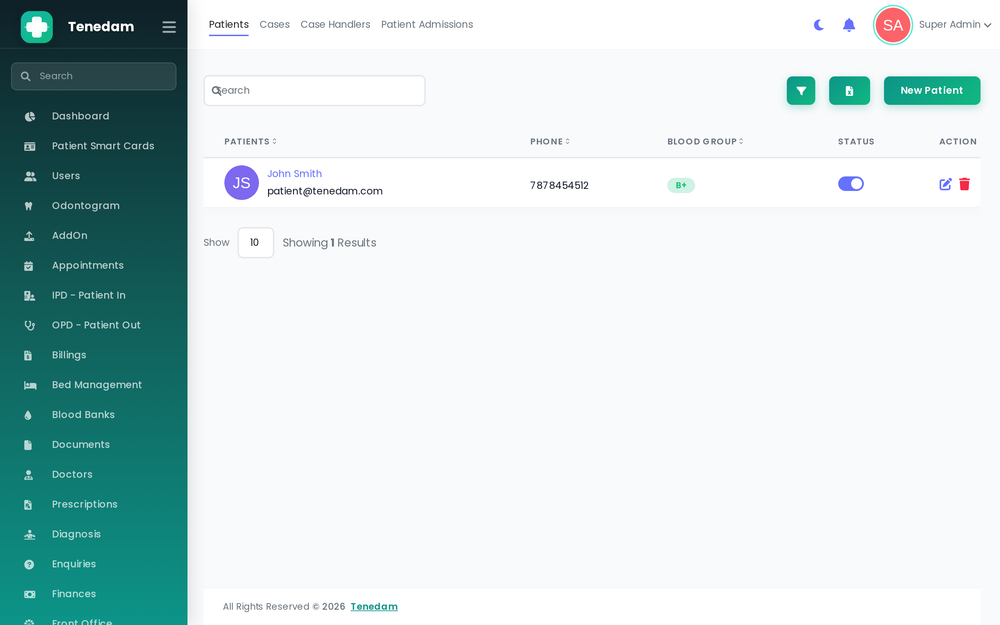</td>
<td width="50%">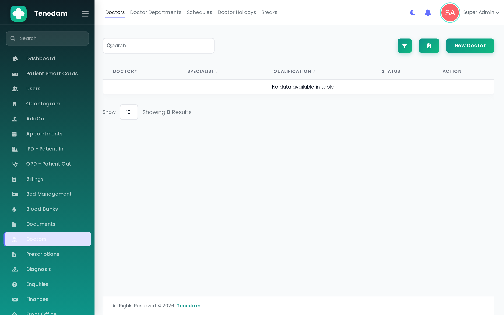</td>
</tr>
<tr>
<td align="center"><b>Patients</b> — Full patient directory with smart search, filters, and OPD/IPD tracking</td>
<td align="center"><b>Doctors</b> — Doctor profiles, departments, specialties, and schedule management</td>
</tr>
<tr>
<td width="50%">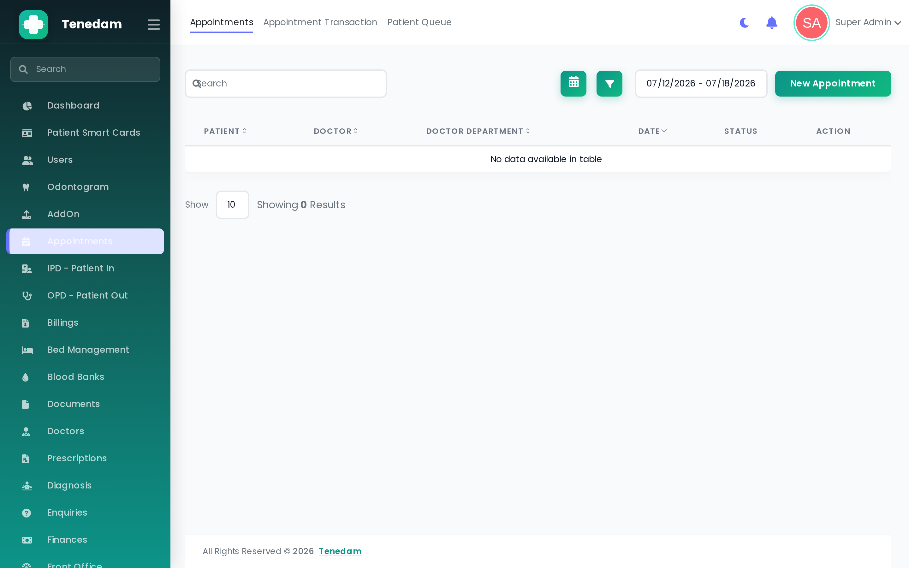</td>
<td width="50%">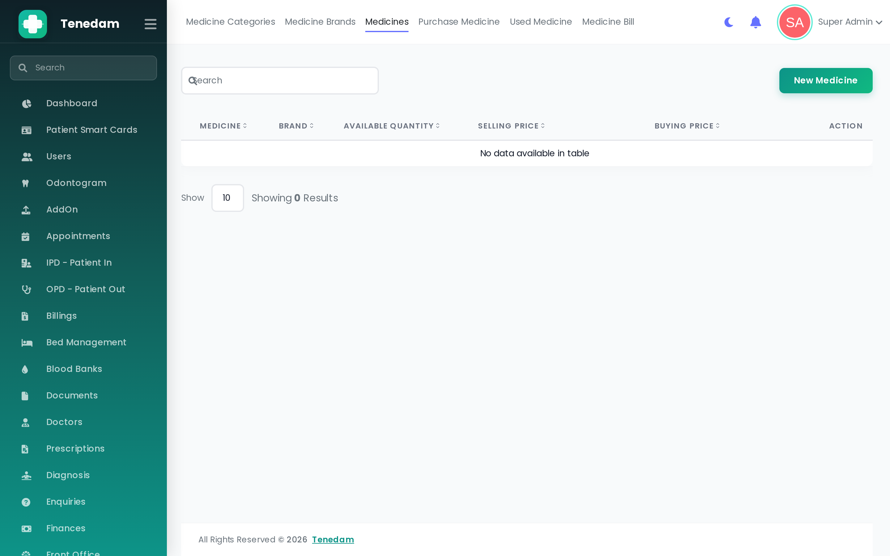</td>
</tr>
<tr>
<td align="center"><b>Appointments</b> — Calendar and list views with status tracking and booking management</td>
<td align="center"><b>Medicines</b> — Complete inventory with categories, brands, and stock alerts</td>
</tr>
<tr>
<td width="50%">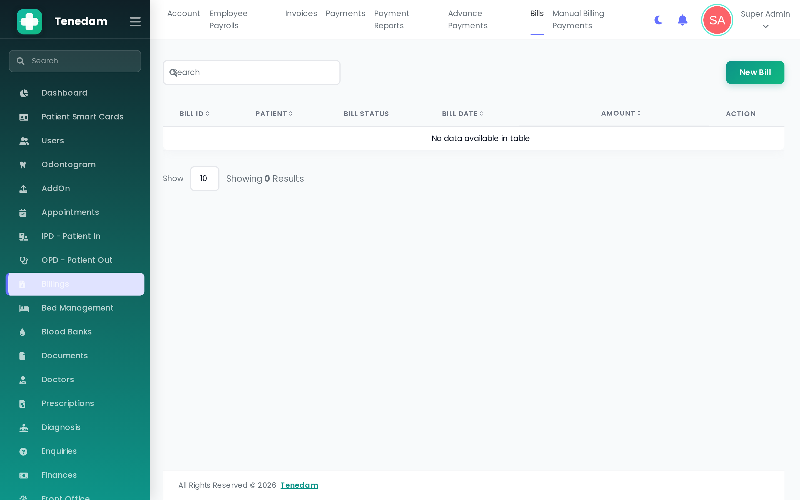</td>
<td width="50%">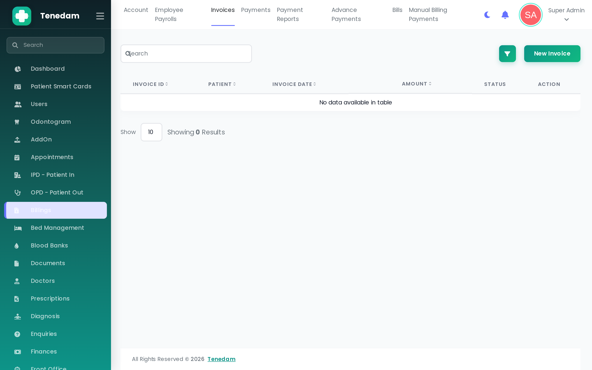</td>
</tr>
<tr>
<td align="center"><b>Bills</b> — OPD and IPD billing with multi-payment support and PDF export</td>
<td align="center"><b>Invoices</b> — Invoice generation, tracking, and payment status management</td>
</tr>
<tr>
<td width="50%">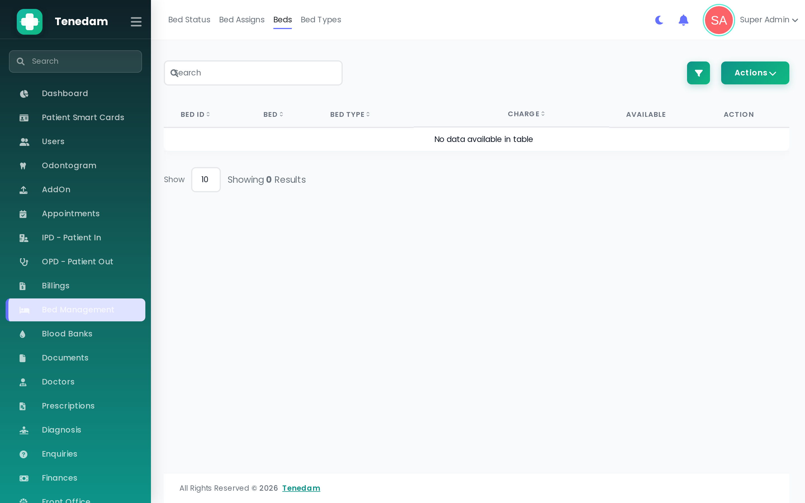</td>
<td width="50%">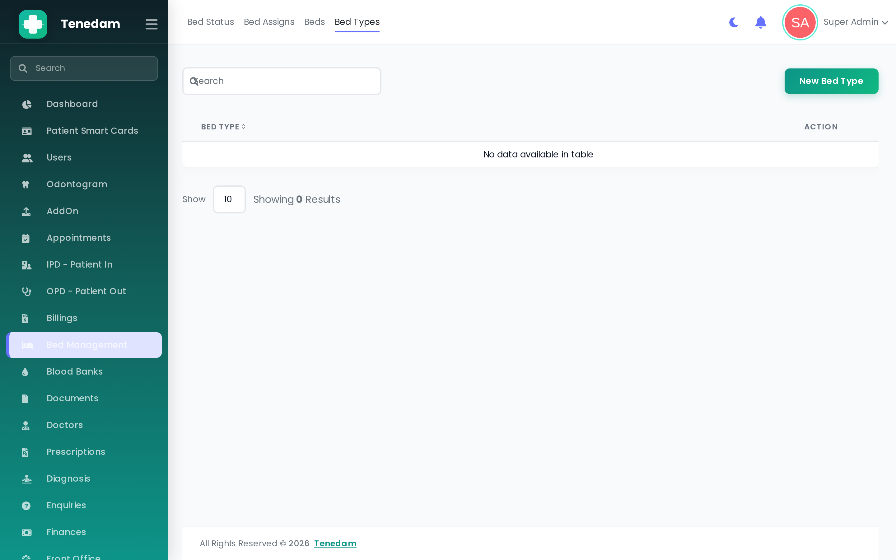</td>
</tr>
<tr>
<td align="center"><b>Beds</b> — Ward bed management with real-time availability status</td>
<td align="center"><b>Bed Types</b> — Bed type categories with charge configuration</td>
</tr>
<tr>
<td width="50%">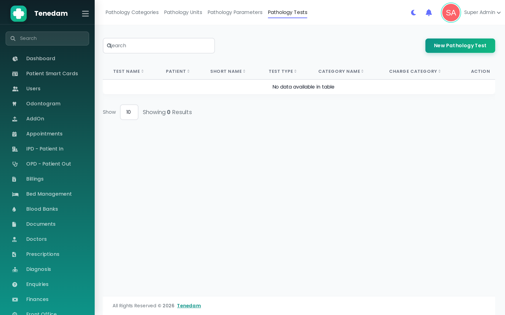</td>
</tr>
<tr>
<td align="center"><b>Pathology</b> — Test categories, parameters, units, and investigation report generation</td>
</tr>
</table>

---

## ✨ Features

### 🏥 Patient Management
- Complete patient registration with custom fields support
- OPD (Outpatient) and IPD (Inpatient) workflows
- Patient case history, timelines, and vaccination records
- Patient ID card generation with QR codes
- Patient queue management system

### 👨‍⚕️ Doctor & Staff Management
- Doctor profiles, specialties, departments, and schedules
- Nurse, pharmacist, lab technician, and receptionist management
- Employee payroll and attendance tracking
- Doctor OPD charges and holiday management

### 📅 Appointments & Scheduling
- Online appointment booking with calendar view
- Appointment transaction tracking
- Doctor availability and hospital schedule management
- Google Calendar integration for sync

### 💊 Pharmacy
- Complete medicine inventory management
- Purchase medicine workflow
- Medicine bills and prescription management
- Stock tracking with low-stock alerts

### 🧪 Pathology & Radiology
- Pathology test categories, parameters, and units
- Patient diagnosis test management
- Radiology categories and test management
- Investigation report generation

### 💰 Billing & Finance
- OPD and IPD billing with multi-payment support
- Advanced payment tracking
- Invoice generation (PDF export)
- Income/expense management and reporting
- Integration with Stripe, PayPal, Razorpay, and Paystack

### 🛏️ Bed & Ward Management
- Bed types, beds, and bed status tracking
- Bed assignment for IPD patients
- Real-time bed availability dashboard

### 🩸 Blood Bank
- Blood donor registration and management
- Blood donation tracking and issue management
- Blood bank inventory

### 📊 Dashboard & Analytics
- Comprehensive admin dashboard with key metrics
- Visual charts for revenue, patient flow, and appointments
- Payment reports and financial analytics

### 🔐 Security & Access
- **9 role-based interfaces** — Admin, Doctor, Nurse, Receptionist, Pharmacist, Accountant, Case Manager, Lab Technician, Patient
- Each role sees only their authorized modules on login
- Two-factor authentication (Google 2FA)
- Laravel Sanctum for API authentication
- JWT token support

### 🌐 Additional Integrations
- **Zoom** — Video consultation support
- **Twilio** — SMS notifications
- **Google Meet** — Live consultations
- **Email** — SMTP-based email templates and notifications
- **Multi-language** — English and Arabic support
- **QR Codes** — Patient ID cards with QR
- **PDF Export** — Reports, invoices, and prescriptions via DomPDF
- **Excel Export** — Data export via Laravel Excel

---

## 🛠 Tech Stack

| Layer | Technology |
|-------|-----------|
| **Backend** | Laravel 10.x, PHP 8.4 |
| **Frontend** | AdminLTE 3, Bootstrap 5, jQuery, Font Awesome 6 |
| **Reactive UI** | Livewire 3, Alpine.js |
| **Database** | SQLite (also supports MySQL) |
| **Authentication** | Laravel Sanctum, JWT, Google 2FA |
| **Payments** | Stripe, PayPal, Razorpay, Paystack |
| **APIs** | Google Calendar, Zoom, Twilio, Google Client |
| **PDF** | DomPDF |
| **Excel** | Laravel Excel (Maatwebsite) |
| **Build** | Laravel Mix, Node.js, NPM |

---

## 🧩 Modules

Tenadam is organized into **100+ functional modules** covering every aspect of hospital operations:

| Category | Modules |
|----------|---------|
| **Patient** | Patients, OPD, IPD, Cases, Vaccinations, Queues, ID Cards |
| **Clinical** | Prescriptions, Diagnoses, Operations, Birth/Death Reports |
| **Pharmacy** | Medicines, Purchase, Bills, Stock, Categories |
| **Lab** | Pathology Tests, Parameters, Units, Investigation Reports |
| **Radiology** | Categories, Tests |
| **Billing** | Bills, Invoices, Payments, Advanced Payments, Insurance |
| **HR** | Employees, Payrolls, Schedules, Departments |
| **Inventory** | Items, Stocks, Categories, Brands, Issued Items |
| **Facility** | Beds, Bed Types, Bed Assignments, Ambulances |
| **Blood Bank** | Donors, Donations, Issues, Bank Management |
| **Admin** | Users, Roles, Settings, Currency, Front Settings |
| **Communication** | Email, SMS, Notice Board, Testimonials |
| **Integration** | Zoom, Google Calendar, Payment Gateways |

---

## 🏁 Getting Started

### Prerequisites

- **PHP** >= 8.2
- **Composer** >= 2.0
- **Node.js** >= 18
- **NPM** >= 9

### Installation

```bash
# 1. Clone the repository
git clone https://github.com/Hope0351/Tenadam.git
cd Tenadam

# 2. Install PHP dependencies
composer install

# 3. Generate application key
php artisan key:generate

# 4. Generate JWT secret
php artisan jwt:secret

# 5. Configure your environment
cp .env.example .env
# Edit .env with your database and mail settings

# 6. Run database migrations
php artisan migrate

# 7. Seed the database
php artisan db:seed

# 8. Install and build frontend assets
npm install
npm run dev        # Development
npm run production # Production

# 9. Start the development server
php artisan serve
```

> **Default Admin Login:** `admin@tenedam.com` / `123456789`

### Virtual Host (Recommended)

For the best experience, set up a virtual host pointing to the `public` directory:

```apache
<VirtualHost *:80>
    ServerName tenedam.local
    DocumentRoot /path/to/Tenadam/public
    <Directory /path/to/Tenadam/public>
        AllowOverride All
        Require all granted
    </Directory>
</VirtualHost>
```

---

## 📁 Project Structure

```
Tenadam/
├── app/                  # Laravel application core
│   ├── Http/            # Controllers, Middleware, Requests
│   ├── Models/          # Eloquent models
│   └── Providers/       # Service providers
├── config/              # Configuration files
├── database/            # Migrations, seeders, SQLite DB
├── docs/
│   └── screenshots/     # Project screenshots
├── Modules/             # Modular feature packages
├── public/              # Web-accessible root
│   ├── assets/          # Compiled CSS, JS, images
│   ├── vendor/          # Frontend vendor packages
│   └── web/             # Public website assets
├── resources/
│   └── views/           # Blade templates (100+ modules)
├── routes/              # Route definitions
├── storage/             # Logs, cache, uploads
├── webpack.mix.js       # Laravel Mix build config
├── composer.json        # PHP dependencies
└── .env                 # Environment configuration
```

---

## 🤝 Contributing

Contributions are welcome! Please follow these steps:

1. Fork the repository
2. Create your feature branch (`git checkout -b feature/amazing-feature`)
3. Commit your changes (`git commit -m 'Add amazing feature'`)
4. Push to the branch (`git push origin feature/amazing-feature`)
5. Open a Pull Request

---

## 📄 License

This project is licensed under the **MIT License** — see the [LICENSE](LICENSE) file for details.

---

<div align="center">

**Built with ❤️ for better healthcare**

*Tenadam — ጤና አዳም — Health of Adam*

</div>